# architecture

Here's a full breakdown — starting with the feature set, then the architecture.

**Feature set first:**

[]

Now the tech architecture — how this actually gets built: 

[]

Here's the full breakdown of each layer:

**External integrations (what you pull from)**
- Azure DevOps REST API — commits, PRs, work items, pipelines, all filterable by user and date range
- A public holidays API (e.g. Nager.Date, free) — injects country-specific holidays automatically by team member location
- Optional: SMTP / MS Teams webhook for notifications

**Backend (Node.js or Python)**
- A **sync worker** runs on a schedule (e.g. nightly or hourly) to pull DevOps activity per user and store it locally — this keeps your app fast and not dependent on ADO being up
- A **REST API** handles auth (Azure AD OAuth is ideal, since your users already have it), leave requests, approvals, and timesheet reads/writes
- A **timesheet engine** is the core logic — it merges DevOps activity per day + leave/sick flags + public holidays into a structured daily log per person per month
- A **report generator** takes that structured log and renders a PDF or Excel file on demand or on a monthly cron

**Data layer**
- PostgreSQL for everything relational (users, teams, leave requests, timesheet records)
- Redis for caching API responses and as a job queue for the sync worker and report generation
- S3 or Azure Blob Storage for generated PDFs

**Frontend**
- A web app (React/Next.js) is the primary surface — manager dashboard, team calendar, individual timesheets
- An Azure DevOps marketplace extension (built with the ADO Extension SDK) is the power move — it embeds your KPI widgets directly inside ADO dashboards, which removes the need to convince teams to use a separate tool
- A mobile app is optional at first but useful for leave requests on the go

---

**Build order recommendation**

Start with just three things: the sync worker, the timesheet engine, and a simple web UI with PDF export. That's the MVP you can charge for. Leave approval workflow and the ADO extension come in v2, mobile in v3.

The Azure AD OAuth integration is worth doing early — it removes the "another login" friction that kills adoption in enterprise tools.

Want me to sketch the database schema or the MVP scope in more detail?
